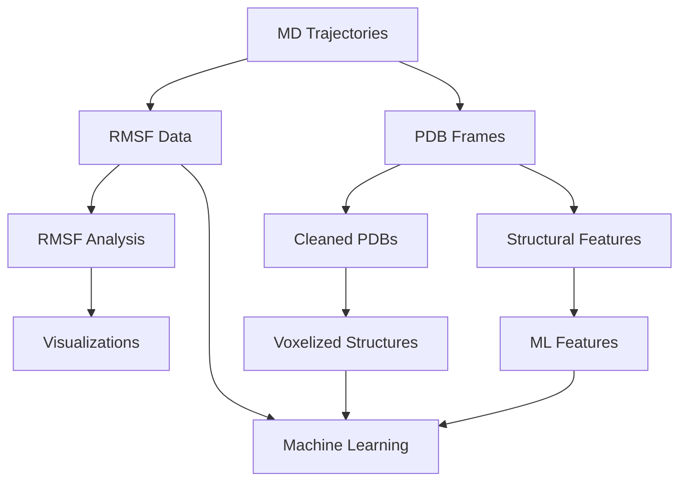

# 🧬 mdCATH Processor Pipeline

[](https://www.python.org/downloads/)
[](LICENSE)

> A comprehensive pipeline for processing Molecular Dynamics simulations from the mdCATH database

## 📋 Table of Contents

- [Overview](#-overview)
- [Features](#-features)
- [Installation](#-installation)
- [Project Structure](#-project-structure)
- [Configuration](#-configuration)
- [Usage](#-usage)
  - [Command-Line Interface](#command-line-interface)
  - [Step-by-Step Guide](#step-by-step-guide)
  - [Complete Pipeline](#complete-pipeline)
- [Data Flow](#-data-flow)
- [Output Files](#-output-files)
- [Advanced Usage](#-advanced-usage)
- [Troubleshooting](#-troubleshooting)
- [Contributing](#-contributing)
- [License](#-license)

## 🔍 Overview

The mdCATH processor pipeline is a comprehensive toolkit for analyzing molecular dynamics (MD) simulations of protein domains from the CATH structural classification database. It extracts valuable information such as RMSF (Root Mean Square Fluctuation) data, representative frames, and generates voxelized representations suitable for machine learning applications.

## ✨ Features

- 📊 **RMSF Extraction**: Extract per-residue fluctuation data across multiple temperatures
- 🎬 **Frame Selection**: Extract representative frames using multiple methods (RMSD, gyration radius, etc.)
- 🧼 **PDB Cleaning**: Fix common issues in PDB files (chain IDs, atom numbering)
- 📦 **Voxelization**: Convert PDB structures to 3D voxel grids for machine learning
- 📈 **RMSF Analysis**: Generate statistics and visualizations from RMSF data
- 🔬 **Feature Extraction**: Create ML-ready features for protein stability prediction
- 🔄 **Multi-temperature Processing**: Analyze proteins across temperature range (320K-450K)
- 🚀 **Multiprocessing Support**: Efficiently process multiple domains in parallel

## 📥 Installation

### Prerequisites

- Python 3.8 or higher
- HDF5 libraries
- Aposteriori (for voxelization)

### Setting up the environment

```bash
# Clone the repository
git clone https://github.com/yourusername/mdcath.git
cd mdcath

# Create and activate a virtual environment (recommended)
python -m venv venv
source venv/bin/activate  # On Windows: venv\Scripts\activate

# Install dependencies
pip install -r requirements.txt

# Install the package in development mode
pip install -e .
```

## 📁 Project Structure

```
mdcath/
├── cli/                   # Command-line interface
│   ├── cli.py             # Main CLI implementation
│   └── __init__.py
├── config/                # Configuration handling
│   ├── config.py          # Configuration loader
│   ├── config.yaml        # Main configuration file
│   └── config.yaml.example
├── extraction/            # Data extraction modules
│   ├── frame_extractor.py # Frame extraction from trajectories
│   ├── h5_reader.py       # HDF5 file reader for mdCATH dataset
│   └── rmsf_extractor.py  # RMSF data extraction
├── feature_extraction/    # Feature generation
│   ├── consolidator.py    # Data consolidation
│   ├── encoders.py        # Feature encoding utilities
│   └── feature_generator.py
├── processing/            # Data processing modules
│   ├── pdb_cleaner.py     # PDB file cleaning
│   ├── rmsf_analyzer.py   # RMSF data analysis
│   └── validation.py      # Data validation utilities
├── utils/                 # Utility modules
│   ├── file_utils.py      # File handling utilities
│   ├── logging_utils.py   # Logging configuration
│   └── multiprocessing_utils.py
├── voxelization/          # 3D voxelization
│   ├── aposteriori_runner.py  # Aposteriori voxelization
│   └── voxel_formatter.py     # Output formatting
├── __init__.py
├── version.py
├── setup.py               # Package setup script
└── README.md              # This file
```

## ⚙️ Configuration

The pipeline is configured using a YAML file (`config/config.yaml`). A template is provided in `config/config.yaml.example`.

### Key Configuration Parameters

```yaml
input:
  mdcath_dir: /path/to/mdcath/data/    # Directory containing MD simulation HDF5 files
  domain_ids: []                        # List of domains to process (empty for all)
  temperatures:                         # Temperatures to process (K)
    - 320
    - 348
    - 379
    - 413
    - 450

output:
  base_dir: ~/path/to/output/           # Base output directory
  pdb_frames_dir: interim/aposteriori_extracted_pdb_frames_files
  rmsf_dir: interim/per-residue-rmsf
  summary_dir: processed/mdcath_summary
  ml_features_dir: processed/ml_features
  voxelized_dir: processed/voxelized_output
  log_file: pipeline.log

processing:
  frame_selection:
    method: rmsd                        # Frame selection method (rmsd (Cull the min/max 5A get rid of the random noise), regular, gyration, random) # Boltzman try: , Accept: Based on energy, Generate a random number, 
    num_frames: 5                       # Number of frames to extract per temperature
    cluster_method: kmeans              # Clustering method for RMSD-based selection

feature_extraction:
  min_residues_per_domain: 0            # Minimum residues for domain inclusion (0 = no minimum)
  max_residues_per_domain: 50000        # Maximum residues for domain inclusion
  normalize_features: true              # Whether to normalize features

voxelization:
  frame_edge_length: 12.0               # Size of voxel grid (Å)
  voxels_per_side: 21                   # Resolution of voxel grid
  atom_encoder: CNOCACB                 # Atom encoding scheme

performance:
  num_cores: 0                          # Number of CPU cores (0 = auto-detect)
  batch_size: 10                        # Batch size for processing
  memory_limit_gb: 16                   # Memory limit in GB
```

## 🚀 Usage

### Command-Line Interface

The pipeline provides a comprehensive command-line interface for running individual steps or the complete pipeline.

```bash
# Show help
python -m mdcath.cli --help

# List available domains
python -m mdcath.cli list

# Run the complete pipeline
python -m mdcath.cli all
```

### Step-by-Step Guide

#### 1. Extract RMSF Data

```bash
python -m mdcath.cli extract-rmsf [--domains DOMAIN_IDS] [--temps TEMPERATURES]
```

Extracts per-residue RMSF values from trajectories and saves to CSV files.

#### 2. Extract Representative Frames

```bash
python -m mdcath.cli extract-frames [--domains DOMAIN_IDS] [--temps TEMPERATURES] [--num-frames N] [--method METHOD]
```

Extracts representative frames from trajectories using RMSD, regular intervals, gyration radius, or random selection.

#### 3. Clean PDB Files

```bash
python -m mdcath.cli clean-pdbs
```

Processes extracted PDB files to fix chain IDs, atom numbering, and other issues.

#### 4. Voxelize Structures

```bash
python -m mdcath.cli voxelize [--domains DOMAIN_IDS] [--atom-encoder ENCODER]
```

Converts PDB structures to 3D voxel grids using Aposteriori.

#### 5. Analyze RMSF Data

```bash
python -m mdcath.cli analyze-rmsf
```

Generates statistical analyses and visualizations of RMSF data.

#### 6. Generate Structural Features

```bash
python -m mdcath.cli generate-features [--domains DOMAIN_IDS]
```

Creates structural features from PDB files (core/exterior classification, secondary structure, etc.).

#### 7. Create ML-Ready Features

```bash
python -m mdcath.cli create-ml-features [--min-residues MIN] [--max-residues MAX] [--no-normalize]
```

Consolidates RMSF data and structural features into ML-ready datasets.

### Complete Pipeline

Run all steps in sequence with a single command:

```bash
python -m mdcath.cli all [--domains DOMAIN_IDS] [--temps TEMPERATURES] [--num-frames N] [--method METHOD] [--atom-encoder ENCODER]
```

## 📊 Data Flow



## 📋 Output Files

The pipeline generates the following output files:

| Directory | Contents | Format | Description |
|-----------|----------|--------|-------------|
| `interim/per-residue-rmsf/{temp}/` | RMSF data per temperature | CSV | Per-residue RMSF values for each domain and temperature |
| `interim/per-residue-rmsf/average/` | Average RMSF data | CSV | RMSF values averaged across temperatures |
| `interim/aposteriori_extracted_pdb_frames_files/` | Extracted frames | PDB | Representative PDB structures from trajectories |
| `cleaned_pdb_frames/` | Cleaned PDB files | PDB | PDB files with fixed chain IDs and atom numbering |
| `processed/voxelized_output/` | Voxelized structures | HDF5 | 3D voxel grids for machine learning input |
| `processed/mdcath_summary/` | Analysis results | CSV, PNG | Statistical summaries and visualizations of RMSF data |
| `structure_features/` | Structural features | CSV | Core/exterior classification, secondary structure, etc. |
| `processed/ml_features/` | ML-ready features | CSV | Consolidated features for machine learning |

### Example Data Output (RMSF CSV)

```
protein_id,resid,resname,rmsf_320
1a15A00,1,LYS,1.2625684
1a15A00,2,PRO,1.065294
1a15A00,3,VAL,0.9096526
1a15A00,4,SER,0.7370275
1a15A00,5,LEU,0.59243214
...
```

### Example ML Feature Output

```
domain_id,protein_size,resid,resname,resname_encoded,normalized_resid,core_exterior,core_exterior_encoded,secondary_structure,secondary_structure_encoded,relative_accessibility,rmsf,rmsf_log,relative_accessibility_norm
1a15A00,67,1,LYS,9,0.0,unknown,0,unknown,0,0.5,1.2625684,0.8165006281791639,0
1a15A00,67,2,PRO,13,0.015,unknown,0,unknown,0,0.5,1.065294,0.7252725891602951,0
...
```

## 🔧 Advanced Usage

### Processing Specific Domains

```bash
python -m mdcath.cli all --domains 1a15A00 1b4fA00 1cukA01
```

### Changing Voxel Encoding

```bash
python -m mdcath.cli all --atom-encoder CNOCBCA
```

Available encoders:
- `CNO`: Carbon, Nitrogen, Oxygen atoms only
- `CNOCB`: CNO + Beta carbon atoms
- `CNOCACB`: CNO + Alpha and Beta carbon atoms

### Selecting Frame Extraction Method

```bash
python -m mdcath.cli all --method rmsd --num-frames 10
```

Available methods:
- `rmsd`: RMSD-based selection (optimized for diversity)
- `regular`: Regular interval selection
- `gyration`: Selection based on gyration radius
- `random`: Random frame selection

### Disabling Residue Filtering

To process all domains regardless of size, set in config:

```yaml
feature_extraction:
  min_residues_per_domain: 0
  max_residues_per_domain: 50000
```

## ❓ Troubleshooting

### Common Issues

- **Missing HDF5 files**: Ensure your `mdcath_dir` points to the correct directory containing the HDF5 files.
- **Aposteriori not found**: Make sure Aposteriori is properly installed and in your PATH.
- **Memory errors**: Reduce batch size or increase memory limit in configuration.
- **Missing structural features**: Run `generate-features` before `create-ml-features`.

### Checking Pipeline Status

View log file for detailed information:

```bash
tail -f ~/path/to/output/pipeline.log
```

## 🤝 Contributing

Contributions are welcome! Please feel free to submit a pull request.

1. Fork the repository
2. Create a feature branch (`git checkout -b feature/amazing-feature`)
3. Commit your changes (`git commit -m 'Add amazing feature'`)
4. Push to the branch (`git push origin feature/amazing-feature`)
5. Open a Pull Request

## 📄 License

This project is licensed under the MIT License - see the LICENSE file for details.

---

Made with ❤️ by Felix Burton
